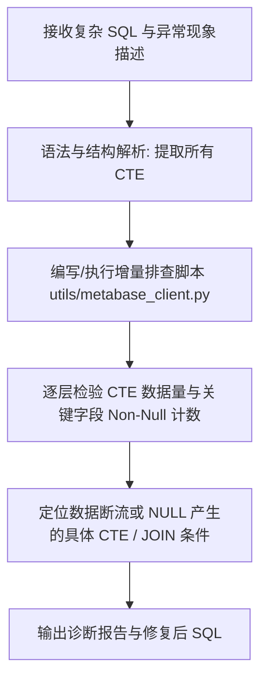

# Debug Complex SQL (复杂 SQL 拆分诊断指南)

当遇到复杂 SQL（如包含多层 CTE、复杂 `JOIN`、`RANK() OVER`、`LEFT JOIN` 或条件筛选）查询结果异常（例如某列数据为空、查询结果为 0 条、关联数据丢失等）时，按本指南步骤进行结构化拆分与层层排查。

---

## 核心诊断流程



---

## 详细执行步骤

### 1. SQL 结构拆分 (CTE / Subquery Decomposition)
- 分析 SQL 的依赖链，罗列出所有的 CTE 名称及其依赖关系。
- 明确用户指出的异常点（如：`class_id` 为空、行数为 0、字段聚合值不对等）。
- 找出关键字段（例如 `class_id`）是在哪一步产生、在哪一步被传递、在哪一步做 `LEFT JOIN` / `INNER JOIN`。

### 2. 增量工具执行 (Incremental Execution via Metabase Client)
使用项目现有的 Metabase 原生客户端 `utils.metabase_client` 进行实际数据查询验证。

你可以通过内联 Python 命令或临时 Python 脚本执行查询：

```python
from utils.metabase_client import client_from_secrets, metabase_data_to_dataframe

client = client_from_secrets()

# 示例：只查第 1 层 CTE
sql_step1 = """
WITH repurchase_term AS (
    SELECT t1.tid, t1.camp_id, t2.id AS term_id, t2.rank, t3.camp_name
    FROM warehouse.dim_lh_teaching_repurchase_camp t1
    JOIN warehouse.dim_lh_class_term t2 ON t1.camp_id = t2.camp_id
    JOIN warehouse.dim_lh_class_camp t3 ON t1.camp_id = t3.id
    WHERE t1.`status` = 1 AND t1.tid = 189
)
SELECT COUNT(*) as cnt, COUNT(term_id) as non_null_term FROM repurchase_term;
"""

df1 = metabase_data_to_dataframe(client.query_raw(sql_step1))
print(df1)
```

> **注意：**
> 1. StarRocks / Metabase 中的 Hint（如 `[shuffle]`）若在局部单独查时报语法错误，可适当去除 Hint 后调试。
> 2. 表名必须带有数据库 schema 前缀（如 `warehouse.xxx`），否则 Metabase 会默认打到 `doris` 库报错。

### 3. 逐层断点排查策略 (Break-point Check Strategy)

针对常见 SQL 异常现象的专用排查路径：

#### 现象 A：某列（如 `class_id`）全为 NULL / 空
1. **源头检查**：查看最早产出该列的 CTE（例如 `authorize_account`），检查 `SELECT` 列表中该列的来源（如 `t1.grant_class_id AS class_id`）。
2. **JOIN 关联类型检查**：
   - 如果下游 CTE（如 `pay_authorize_account`）使用了 `dwd_class_term_student_order t2 LEFT JOIN authorize_account t1 ON ...`，检查 `t2.account_id` 与 `t1.account_id` 是否匹配。
   - 若 `t1` 中无匹配记录，则 `LEFT JOIN` 后 `t1.class_id` 自然变为 `NULL`！
3. **关联条件约束检查**：
   - 检查 `ON` 条件中是否加入了额外限制（如 `AND t1.tid = t4.tid`），导致匹配失败。
4. **窗口函数过滤检查**：
   - 检查是否在子查询中加入了 `RANK() OVER (...) r` 且外面过滤 `WHERE r = 1`，导致主记录被过滤。

#### 现象 B：整体查询结果为 0 条 (Empty Result)
1. 从基础表/第一级 CTE 开始，打印 `COUNT(*)`。
2. 逐个累加 `JOIN` 节点，观察 `COUNT(*)` 在哪个 `JOIN` 后直接变为 0。
3. 检查是否有 `INNER JOIN` 匹配为空，或 `WHERE` 子句中包含互斥条件。

---

## 输出规范

完成排查后，必须向用户输出结构清晰的诊断报告：

1. **异常原因诊断**：点明具体是哪个 CTE、哪个 `JOIN` 关联条件或哪个数据源缺失导致了问题。
2. **排查数据证据**：列出分步查询得到的关键数据（如各 CTE 的记录条数、关联匹配率）。
3. **修复方案与 SQL**：提供修正后的完整 SQL 语句，并对修改点加以说明。
