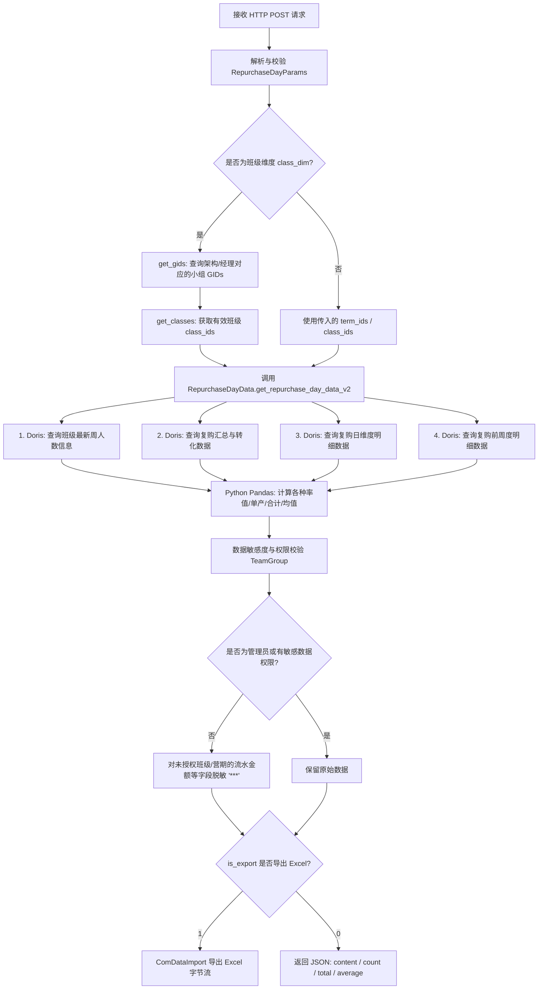

# `/repurchase_day_data` 接口执行逻辑与 SQL 分析文档

## 2. 核心执行逻辑主流程



### 2.3 Doris OLAP 基础数据获取与核心算法处理

1. **获取班级最新人数基础数据**：`authorize_num`（授权在读人数）、`original_num`（原始人数）及 `refund_num`（退费人数）。

```sql
select term_id, class_id, original_num, authorize_num,refund_num, current_week
from (
    select 
        cw.term_id, 
        cw.class_id, 
        cw.original_num, 
        cw.authorize_num,cw.refund_num, 
        r as current_week,
        row_number() over (partition by cw.term_id, cw.class_id order by nvl(cw.abs_week, 0) desc) as r
    from warehouse.dws_lh_teaching_term_class_week cw
    LEFT JOIN warehouse.dim_lh_teaching_operate_week ow 
        ON cw.term_id = ow.term_id 
       AND cw.`year` = ow.`year` 
       AND cw.`month` = ow.`month` 
       AND cw.`week` = ow.`week`
    where cw.class_id in ({{class_ids}})  and cw.term_id in ({{term_ids}})
) t
where r = 1;
```


2. **基数与低价人数配置**：调用 `get_tid_low_price_num()` 和 `get_class_low_price_num()`，读取团队的低价转化率分母配置（默认 `0.025`）及班级低价人数。
3. **复购阶段日明细数据**：调用 `get_repurchase_day_data_by_doris()`，联表 `dim_term_repurchase_stage_conf` 过滤处于复购时间区间（`repurchase_start_date` ~ `repurchase_end_date`）内的日数据，并将物理日期转换为 `dt`（转化第几日，如 Day 1、Day 2）。
4. **复购汇总与持续转化周数据**：调用 `get_repurchase_common_data_by_doris()`，提取定金支付、尾款支付、直播间/个销支付人数与金额、转化第 1/2 周金额等。
5. **转化前周度数据（可选）**：若设置了 `pre_weeks_value`，调用 `get_pre_weeks_data_by_doris()` 提取复购前 N 周的录播/直播完课率、作业提交率、高潜力人数等。
6. **指标算法重计算 (`calculate_func`)**：
   * 在 Pandas 中对各维度指标做离线/实时计算，包括：
     * **退费率** = `refund_num / original_num`
     * **日尾款转化率** = `tail_pay_intraday_num / authorize_num (或 original_num)`
     * **日单产** = `pay_intraday_amount / low_price_num`
     * **到播留存率** = `valid_watch_live_num / watch_live_num`
     * **定金追回率** = `deposit_complete_pay_total_num / deposit_pay_total_num`
7. **班级转化进度计算**：根据 `repurchase_start_date` 和当前日期判定班级状态（`未开始转化` / `DayX` / `转化期已结束`）。
8. **汇总（Total）与均值（Average）计算**：调用 `get_summary_v2` / `fill_weed_data_v2` 生成 `total_data` 与 `average_data`。

### 2.4 数据权限校验与敏感字段脱敏 (Data Masking)
* 调用 `TeamGroup.is_admin_position()` 判定是否为管理员。
* 调用 `TeamGroup.is_revenue_sensitive_data()` 通过外部 LH-AM 权限系统校验是否有营收敏感数据权限。
* **脱敏逻辑**：若非管理员且无营收敏感权限：
  * 调用 `TeamGroup.get_auth_class_ids()` 查出当前用户管辖授权的班级 ID 列表。
  * 对不在授权范围内的班级或营期维度数据，将所有财务敏感字段（如 `pay_intraday_amount`, `full_pay_amount`, `pay_amount`, `transform_amount`, `pay_intraday_live_amount` 等）强制替换为脱敏掩码 `'***'`。

### 2.5 格式化输出
* 若 `is_export == 1`：使用 `ComDataImport` 将多级表头的 DataFrame 转换为 Excel 格式输出。
* 若 `is_export == 0`：返回标准格式 JSON，包含 `content` (明细列表)、`count` (条数)、`total` (合计)、`average` (平均值)。

---

## 3. 关键 SQL 语句汇总

### 3.3 班级最新周人数及在读数据

```sql
SELECT term_id, class_id, original_num, authorize_num, refund_num, current_week
FROM (
    SELECT 
        cw.term_id, 
        cw.class_id, 
        cw.original_num, 
        cw.authorize_num,
        cw.refund_num, 
        cw.abs_week AS current_week,
        ROW_NUMBER() OVER (
            PARTITION BY cw.term_id, cw.class_id 
            ORDER BY NVL(cw.abs_week, 0) DESC
        ) AS r
    FROM dws_lh_teaching_term_class_week cw
    WHERE cw.class_id IN %(class_ids)s 
      AND cw.term_id IN %(term_ids)s 
) t
WHERE r = 1;
```

### 3.4 复购日维度明细数据 (`get_repurchase_day_data_by_doris`) 【核心 SQL】
* **数据源**：Doris DB (OLAP)
* **代码位置**：[`db.py:L568`](file:///e:/sfjy/lh-business-intelligence-platform/rules_server/lh_teacher/db.py#L568)

```sql
SELECT
    ccd.class_id AS class_id, 
    ccd.dt AS dt,
    ccd.term_id AS term_id,
    tail_pay_live_num,
    tail_pay_not_live_num,
    tail_pay_intraday_num, 
    tail_pay_intraday_num_have_refund,
    deposit_pay_num,
    pay_intraday_amount,
    watch_live_num,
    valid_watch_live_num_realtime AS valid_watch_live_num,
    real_discuss_cnt,
    lecturer_reply_cnt,
    barrage_cnt,
    no_pay_live_num,
    follow_live_num,
    pay_intraday_amount_have_refund,
    pay_intraday_amount_guaranteed,
    deposit_tail_pay_num,
    deposit_complete_pay_total_num,
    watch_duration_attended,
    deposit_pay_total_num,
    pay_num,
    deposit_pay_live_num,
    deposit_pay_no_live_num AS deposit_pay_not_live_num,
    pay_live_num AS pay_live_num_day,
    pay_no_live_num AS pay_no_live_num_day,
    full_pay_amount AS full_pay_amount_day,
    no_pay_valid_watch_live_num,
    no_pay_authorize_num
FROM dws_lh_teaching_repurchase_category_class_day ccd 
JOIN dim_term_repurchase_stage_conf rsc 
    ON ccd.term_id = rsc.term_id 
   AND ccd.class_id = rsc.class_id 
   AND ccd.category_id = rsc.category_id 
   AND rsc.`status` = 1
   AND ccd.dt >= rsc.repurchase_start_date 
   AND ccd.dt <= rsc.repurchase_end_date
WHERE ccd.category_id = %(category_id)s 
  AND ccd.term_id IN %(term_ids)s 
  AND ccd.class_id IN %(class_ids)s
  AND DATE(ccd.dt) <= NOW();
```

### 3.5 复购阶段开始日期查询 SQL (用于计算 `dt` 相对天数)
* **数据源**：Doris DB (OLAP)
* **代码位置**：[`db.py:L686`](file:///e:/sfjy/lh-business-intelligence-platform/rules_server/lh_teacher/db.py#L686)

```sql
SELECT term_id, class_id, repurchase_start_date
FROM dim_term_repurchase_stage_conf
WHERE category_id = %(category_id)s
  AND term_id IN %(term_ids)s
  AND class_id IN %(class_ids)s
  AND `status` = 1;
```

### 3.6 复购汇总与持续转化数据 (`get_repurchase_common_data_by_doris`)
* **数据源**：Doris DB (OLAP)
* **代码位置**：[`db.py:L402`](file:///e:/sfjy/lh-business-intelligence-platform/rules_server/lh_teacher/db.py#L402)

```sql
SELECT 
    term_id, 
    class_id, 
    authorize_num, 
    original_num, 
    pay_amount, 
    pay_amount_have_refund,
    tail_pay_live_num, 
    tail_pay_no_live_num, 
    tail_pay_num, 
    create_order_num,
    deposit_pay_num, 
    deposit_tail_pay_num, 
    pay_num, 
    deposit_pay_no_live_num,
    deposit_pay_live_num, 
    pay_live_num, 
    pay_no_live_num,
    transform_end_week1_amount, 
    full_pay_amount, 
    transform_end_week2_amount, 
    transform_after_end_week2_amount,
    pay_live_amount, 
    pay_not_live_amount, 
    high_potential_pay_num
FROM dws_lh_teaching_repurchase_category_class
WHERE category_id = %(category_id)s 
  AND term_id IN %(term_ids)s 
  AND class_id IN %(class_ids)s;
```

### 3.7 用户角色与权限管辖范围查询 (`find_user_role_name`)
* **数据源**：MySQL (`efficiency_db`)
* **代码位置**：[`db.py:L83`](file:///e:/sfjy/lh-business-intelligence-platform/rules_server/lh_teacher/db.py#L83)

```sql
SELECT 
    bwr.id, 
    GROUP_CONCAT(DISTINCT r2.name) AS system_role_name,
    GROUP_CONCAT(DISTINCT r1.name) AS team_role_names
FROM basic_wxworkuser bwr
LEFT JOIN basic_workrelationtg bwg 
    ON bwr.id = bwg.wid 
   AND bwg.tid = %(tid)s 
   AND bwg.`status` = 0 
   AND bwg.term_id = 0
LEFT JOIN basic_role r1 ON FIND_IN_SET(r1.id, bwg.roles)
LEFT JOIN basic_role r2 ON FIND_IN_SET(r2.id, bwr.roles)
WHERE bwr.id = %(wid)s
GROUP BY bwr.id;
```
